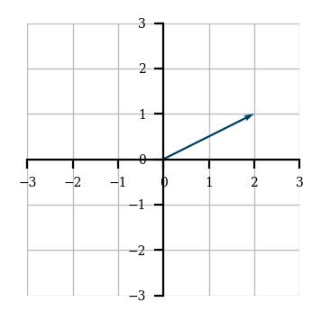
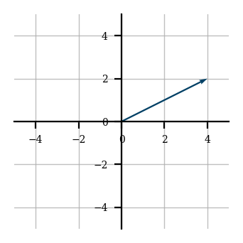
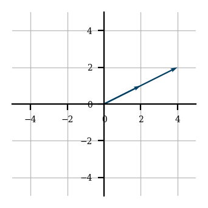

## Matemática computacional - Conceitos base

Este documento apresenta conceitos base para o entendimento da matéria de matemática computacional.

### Conteúdo com métodos discretos

Abaixo são listadas questões úteis para o entendimento da parte de conteúdos de métodos discretos.

* O que é um conjunto linearmente independente ?

Vetores são resultados da combinação linear de outros vetores, sendo esses projetados com as operações de soma e multiplicação.

Mas, existe um grupo de vetores um pouco diferentes, vetores que não podem ser obtidos com a operação conjunta de outros vetores, esses são os chamados de elementos linearmente independentes.

Para fixar o conceito, algumas outras definições são listadas abaixo:

> Um conjunto é dito linearmente independente se não for possível gerar um vetor deste conjunto através da combinação linear de demais conjuntos

> Vetores são linearmente independentes (LI) se nenhum dos vetores puder ser escrito como combinação linear dos demais

* O que é um espaço vetorial ?

Um espaço vetorial é um conjunto *V* equipado com as operações de soma de vetores e de multiplicação por escalares, essas que satisfazem um conjunto de propriedades.

Normalmente ao realizar a definição de um espaço vetorial, é feito um vínculo do mesmo a um determinado conjunto de valores (Por exemplo, conjunto dos números reais, complexos e etc). Tal vínculo não será feito nesta definição uma vez que, o espaço vetorial independe deste tipo de detalhe.

Entendendo o que é um espaço vetorial, voltamos para suas capacidades de soma e multiplicação, definidas anteriormente, essas devem ser feitas seguindo um conjunto de regras, como citado anteriormente, mas mais importante que isso, todas as operações realizadas, sejam elas de soma ou de multiplicação, devem levar a elementos válido do espaço vetorial *V*.

> Em resumo, é o conjunto de todos os vetores possíveis de serem gerados através da manipulação dos vetores base de tal espaço.

* O que é uma base para um espaço vetorial ?

Uma base para um dado espaço vetorial *V* é um conjunto *B* que:
- (a) gera *V* e;
- (b) é linearmente independente.

> Desta forma, as bases são os vetores citados na questão anteriores que, quando manipulados podem gerar todos os elementos do espaço vetorial

* O que é (entrada e saída) um produto escalar ? e um produto vetorial ?

| Método           | Entrada               | Saída         |
|------------------|-----------------------|---------------|
| Produto escalar  | par de vetores (A, B) | Valor escalar |
| Produto vetorial | par de vetores (A, B) | Vetor C       |

Nessa parte é interessante especificamente a interpretação geométrica de cada um dos métodos, essas são citadas abaixo:

**Interpretação geométrica do produto escalar**: 
**Interpretação geométrica do produto vetorial**: 

* O que é a normal de um vetor ?

A normal ou **módulo** de um vetor é o comprimento desse vetor, que pode ser calculado do meio da distância de seu ponto final até a origem.

**Observação**: Achei interessante manter o módulo e até mesmo grifar ele uma vez que, o módulo geometricamente não representa o valor positivo, e sim a distância daquele elemento até sua origem. 

* Como calcular o determinante de uma matriz de ordem 2 ? E para ordens maiores que 3 ?

Para realizar o cálculo da determinantes de matrizes de ordem 2 é necessário realizar a multiplicação de sua diagonal principal e sua diagonal segundária e então subtrair o resultado da diagonal secundária do resultado da diagonal primária.

Para o cálculo da determinante de matrizes 3x3 é possível aplicar o método de Sarrus.

Já para determinantes de ordem N (Considerando N >= 3), é possível utilizar o método de laplace.

> Gosto da interpretação geométrica dos determinantes. Se você imagina que toda matriz é uma transformação linear, então as determinantes são utilizadas para indicar o quanto cada uma das áreas onde a transformação linear é aplicada será distorcida/modificada.

* O que é a transposta de uma matriz ? E a inversa ?

**Transposta de uma matriz**: A operação de transposição de uma matriz é aquele em que se obtém uma nova matriz através da troca de linhas por colunas
Desta forma, uma matriz transposta é aquele que passou pela operação de transposição e deve suas linhas trocadas por colunas (Ou colunas trocas por linhas)

**Matriz inversa**: Para a explicação de tal conceito, vamos voltar a um elemento bem básico, números reais. Imagine dois números reais **i** e **j**, **i** será o inverso de **j** se e somente se, **i** * **j** = 1
Da mesma forma como visto nos valores inteiros, a matriz inversa pode ser entendida como a matriz com valores inversos a sua matriz original (Alterando os valores e mantendo as propriedades de linhas e colunas)

**Lembre-se**: Só existe uma matriz inversa, e ainda, existem matrizes que podem vir a não ter uma matriz inverta!

> Quando comecei a aprender sobre matrizes me perguntei: Por qual motivo eu quero uma matriz inversa ? A resposta é bastante simples, não existe a operação de divisão em uma matriz! Então obtendo sua inversa é possível eu realizar divisões de matrizes através de multiplicações :smile:

* Como fazer multiplicação de matrizes ?

Para responder esta questão é interessante que façamos a divisão deste conceito em alguns contextos, já que, a multiplicação matricial pode representar diferentes comportamentos em contextos diferentes.

**Multiplicação de uma matriz por uma escalar**

Para entender a multiplicação de um matriz por uma escala, primeiro imagine um vetor *V* sendo projetado em um espaço bidimensional, este vetor é formado pelas coordenadas (2, 1)

$$
V = \begin{pmatrix}2&1\end{pmatrix}
$$

Sua representação no plano cartesiano é vista abaixo

    

Certo, agora imagine que queremos escalar as coordenadas desse vetor, chegando em coordendas que são o dobro de onde o vetor está atualmente

$$
\begin{pmatrix}2&1\end{pmatrix}\rightarrow \begin{pmatrix}4&2\end{pmatrix}
$$

Para fazer isso basta realizarmos a multiplicação do vetor por 2, ao realizarmos essa operação estamos `escalando`, essa operação geometricamente pode ser representada com

    

Se colocarmos no plano o vetor anterior e o vetor escalado teremos

    

Desta forma podemos entender que, quando estamos fazendo a multiplicação de um vetor por uma escalar, estamos `escalando` os valores do vetor, ou seja, simplesmente pegando cada elemento do vetor e multiplicando pela escalar.

> O nome escalar vem exatamente da operação que ela causa no vetor.

**Multiplicação de matrizes com elementos n-dimensional**

Antes de verificar o processo de operações com matrizes com elementos multidimensionais, façamos a definição de uma regra bastante importante

Para entender essa regra, suponha uma multiplicação entre as matrizes *A* e *B*, para que essa operação seja válida, é preciso que a quantidade de colunas da matriz *A* seja a mesma quantidade de linhas da matriz *B*.

    </img>

Isso faz com que o produto gerado tenha as dimensões (Linhas de *A*, Colunas de *B*)

    </img>

Pronto! Agora podemos ir para os conceitos de multiplicação matricial.

**Multiplicação de matriz por vetor**

Dado a matriz *M* e o vetor *V*, a multiplicação desses é feita através da multiplicação de todos os elementos de cada linha em *M* por todos os elementos da coluna em *V*.

$$
\begin{pmatrix}a&b\\ c&d\end{pmatrix}\cdot \begin{pmatrix}x\\ y\end{pmatrix}=\begin{pmatrix}ax+by\\ cx+dy\end{pmatrix}
$$

**Multiplicação de matriz por matriz**

A ideia da multiplicação de uma matriz *M* por uma matriz *J* é bastante parecida com o apresentado na seção anterior.

De forma geral, é necessário, para cada linha de *M*, multiplicar seus elementos por cada uma das colunas em *J*.

Como esta é uma operação com mais passos, vamos a um pequeno exemplo

$$
A\:=\:\begin{pmatrix}1&3\\ 2&5\end{pmatrix};\:B=\begin{pmatrix}2&2\\ 0&1\end{pmatrix}
$$

Com as matrizes definidas o que fazemos é realizar a multiplicação de cada uma das linhas da matriz *A* por cada coluna em *B*.

Então, para começar, a primeira linha é multiplicada com a primeira coluna, seu resultado é inserido na matriz resultante.

    </img>

Após isto, a mesma linha em *A*, utilizada na operação anterior é multiplicada com a segunda coluna.

    </img>

Depois, o mesmo passo é repetido para as demais linhas.

    </img>

    </img>

E este é o processo de multiplicação entre matrizes.

### Conteúdo com métodos contínuos

* Quando uma função é contínua ? e diferenciável ?
* Como derivar e integrar polinômios ?
* O que é uma série de Taylor ?
