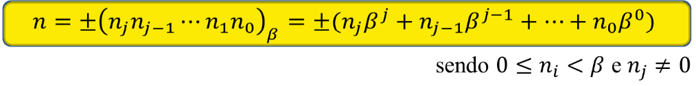
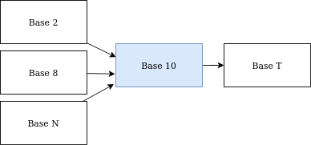
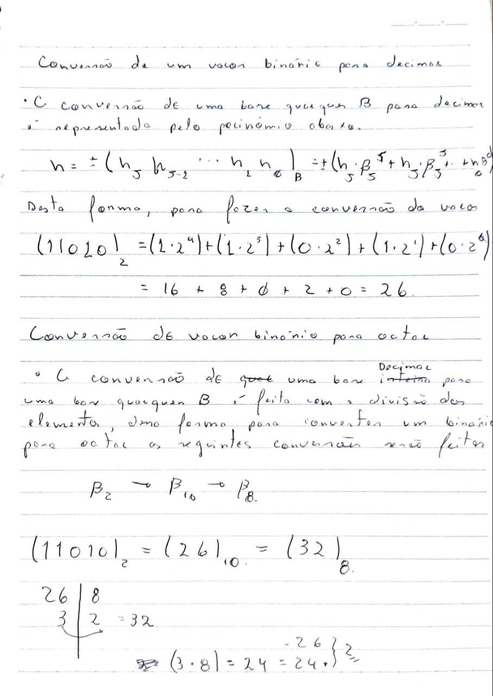

## Lista 1 - Conversão de base numérica

Conversão entre quaisquer duas bases numéricas

### Desenvolvimento da ideia

Para resolver este exercício, foram aplicados os seguintes conceitos. Primeiro, a conversão de uma base *B* para a base 10 é feita através da utilização dos conceitos de notação posicional, onde cada número pode ser recuperado através de uma potência e uma multiplicação.

Para entender melhor, vamos para um exemplo

$$
B10(1427) = (1 * 10^3) + (4 * 10^2) + (2 * 10^1) + (7 * 10^0)
$$

Perceba que, o número `1427` foi obtido através da decomposição de seus elementos. Veja que na regra gerada, o elemento que está sendo elevado é 10, isto porque o número está na base 10, vejamos um exemplo com um valor na base 2

$$
B2(100101) = (1 * 2^5) + (0 * 2^4) + (0 * 2^3) + (1 * 2^2) + (0 * 2^1) + (1 * 2^0) = 37
$$

Com este sistema simples de decomposição é possível converter qualquer número, em qualquer base, para a base decimal (Como o exemplo apresentado acima)

A regra utilizada acima pode ser representada e resumida com um polinômio, apresentado abaixo.

<div align="center">
    
</div>

O segundo conceito utilizado é que, é possível realizar a conversão para qualquer base *B* partindo da base 10 apenas com a divisões sucessivas.

> A regra de parada aplicada nas divisões sucessivas é que, a divisão deve parar assim que o elemento encontrado for menor ou igual a 1

Com os elementos na base 10 o necessário a ser feito é, converter esse elemento para a base de destino. Isso é feito através de divisões consecutivas, assim como explicado anteriormente.

Desta forma, o processo final de conversão utilizado é apresentado abaixo

<div align="center">
    
</div>

### Passo a passo "Na mão"

A figura abaixo representa o processo de conversão feito "Na mão". O método aplicado para tal é implementado e apresentado na seção de `Implementação`

<div align="center">
    
</div>

### Implementação

Todos os passos apresentados na seção anterior foram implementados utilizando a linguagem de programação C++. O código gerado é explicado abaixo.

**Função de conversão para qualquer base**

O trecho de código abaixo apresenta a conversão para qualquer base, nele a lógica aplicada é a mesma apresentada nas seções anteriores, onde os elementos são convertidos para decimal e depois convertidos para base de destino

```cpp
std::string Bases::ToAnyBase(std::string value, int srcBase, int destBase)
{
    std::string valuesInDestBase;
    int valueInDecimal = ToDecimal(value, srcBase);

    // A quantidade pode ser > 1 pq quando é feito a 
    // divisão de um elemento que é menor que a base resta o próprio elemento
    while (valueInDecimal > 1)
    {
        std::string resString;
        int res = valueInDecimal % destBase;
        if (res >= 10) // Somente bases maiores que 10 produzem tal módulo
            resString = ALPHABET[res - 10];
        else 
            resString = std::to_string(res);

        valuesInDestBase.append(resString);
        valueInDecimal = valueInDecimal / destBase;
    }
    std::reverse(valuesInDestBase.begin(), valuesInDestBase.end());
    return valuesInDestBase;
}
```

**Função para conversão em decimal**

A função abaixo é utilizada pela função `ToAnyBase` para realizar a conversão dos dados de entrada para decimal

```cpp
int Bases::ToDecimal(std::string value, int srcBase)
{
    int decimalValue = 0;
    int stringSize = value.size() - 1;

    for(char c: value)
    {
        int numericSymbol = 0;
        if (!std::isdigit(c)) // Caso seja dígito utiliza o strtol, 
                            // que permite inserir digito e 
                            // devolve número (Com uma conversão de base)
            numericSymbol = std::strtol(&c, NULL, srcBase); // converte string para long
        else
            numericSymbol = std::stoi(&c); // Converte string para inteiro
        decimalValue += numericSymbol * std::pow(srcBase, stringSize--);
    }
    return decimalValue;
}
```

**Exemplo de utilização**

Abaixo é feito a apresentação da forma de utilização do código criado

```cpp
#include <iostream>
#include "bases.hpp"

int main()
{    
    std::cout << 1010 << " (bin to dec) " << 
            Bases::ToAnyBase("100101", 2, 10) << std::endl;
    std::cout << 252 << " (dec to bin) " << 
            Bases::ToAnyBase("252", 10, 2) << std::endl;
    std::cout << 2526 << " (dec to hex) " << 
            Bases::ToAnyBase("2526", 10, 16) << std::endl;
    std::cout << "22FA" << " (hex to oct) " << 
            Bases::ToAnyBase("22FA", 16, 8) << std::endl;

    return 0;
}
```

> Todo o código fonte está disponível no diretório [src](src)

### Observações

Abaixo são listadas algumas observações feitas durante o desenvolvimento da lista de exercícios

- As bases `octal` e `hexadecimal` são formas de realizar representações mais simples dos elementos presentes na base `binária`
