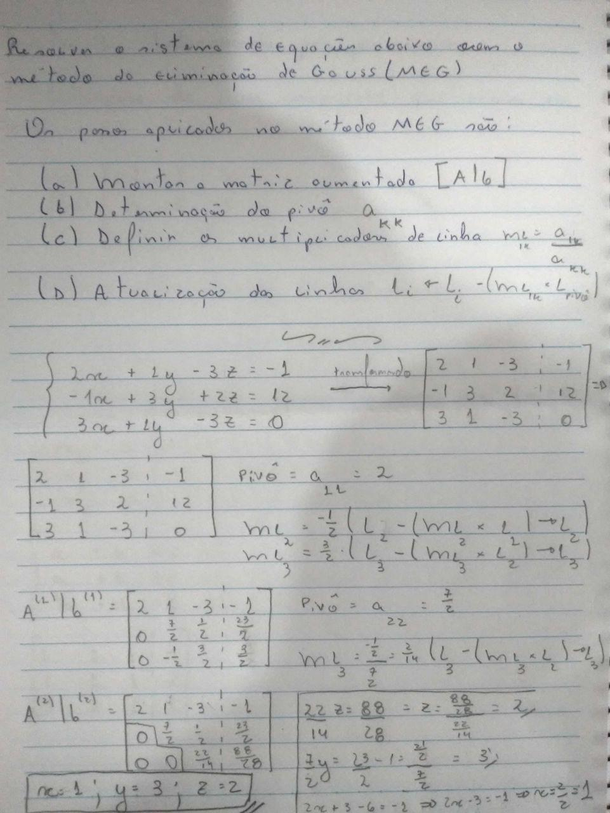
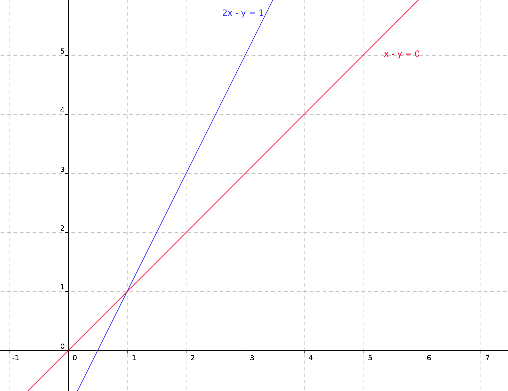
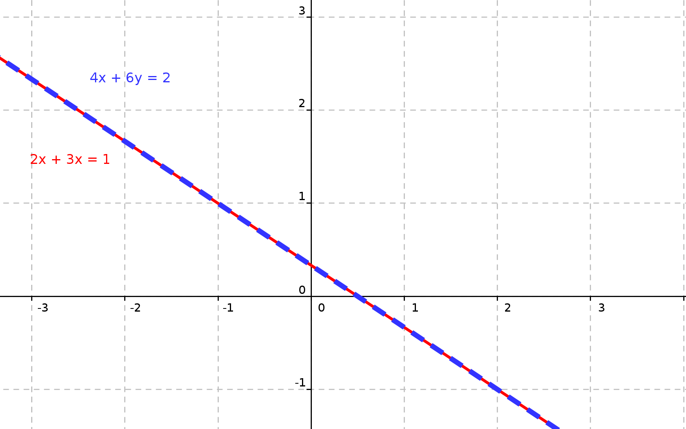
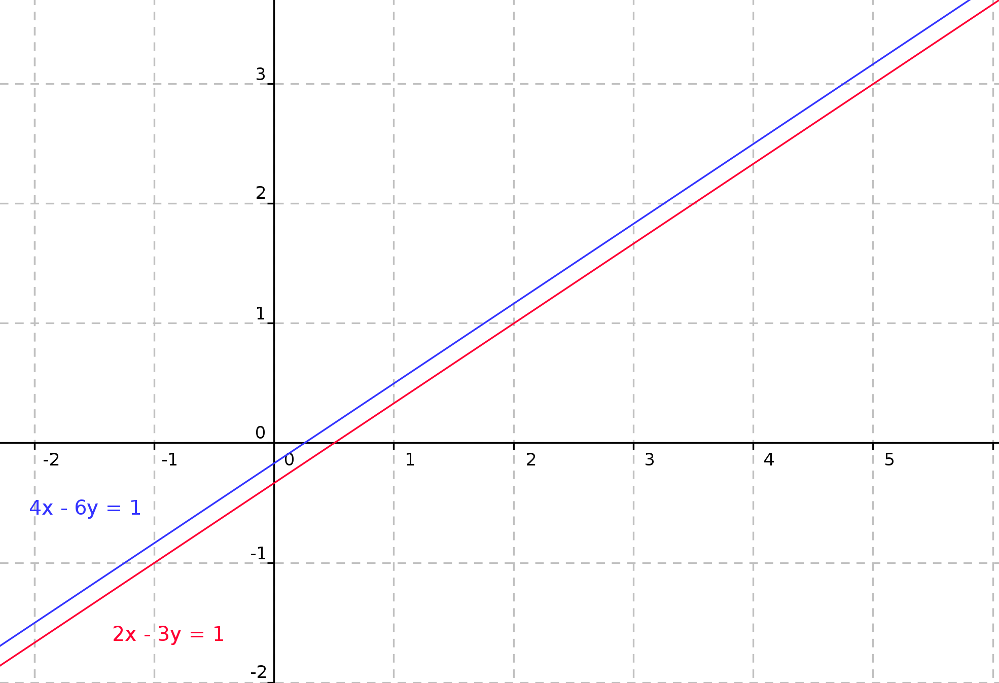

## Lista 2 - Sistemas lineares

Segunda lista de exercícios da matéria de matemática computacional (CAP-239-4), do curso de pós-graduação em Computação Aplicada do Instituto Nacional de Pesquisas Espaciais

Docentes:
- Dr. Leonardo B. L. Santos
- Dr. Reinaldo Rosa

Discente:
- Felipe Menino Carlos

### Exercícios

Abaixo são apresentados os exercícios da lista 2 e suas soluções

**1 - Realize a solução do sistema linear através do Método da Eliminação de Gauss (MEG)**

Para a fixação dos passos necessários para a realização do MEG, o mesmo foi feito passo a passo "na mão". O resultado é apresentado abaixo.

    

Com o resultado apresentado na folha acima, é possível afirmar que a solução do sistema linear apresentado é

$$
\begin{pmatrix}2&1&-3&-1\\ -1&3&2&12\\ 3&1&-3&0\end{pmatrix}\cdot \begin{pmatrix}x\\ y\\ z\end{pmatrix}=\begin{pmatrix}1\\ 3\\ 2\end{pmatrix}
$$

**2 - Pense em uma interpretação geométrica para a solução de sistemas lineares. E considerando um sistema de ordem 2, ilustre**

Inicialmente, considere apenas uma equação. Tal equação possui diversas combinações de solução, de modo a gerar um plano com todas as suas possíveis soluções. Para equações lineares, realizando a visualização geométrica é possível ver tal conceito através de retas geradas pelas possíveis soluções de uma equação.

Tratando de um sistema de equações, a ideia de sua solução está muito vínculada ao plano de soluções possíveis de cada uma das equações que compõem o sistema linear, de modo que:

- Sistemas da classe **Possível e Determinado**, possuem o cruzamento dos planos de solução das equações em um ponto, sendo este a solução do sistema, como apresentado abaixo.

    

- Já sistemas da classe **Possível e Indeterminado**, apresentam infinitas soluções, uma vez que os planos de solução de cada equação se cruzam em infinitos pontos.

    

- Por fim, nos sistemas da classe **Impossível** não há uma relação entre as equações presentes no sistema de equações.

    

**3- O resultado da aproximação da solução da EDO via sistema linear depende da discretização ?**

Sim, para este caso, uma das necessidades do método utilizado (Método de diferenças finitas) é que o espaço trabalhado seja o discreto, desta forma, a discretização é necessária para a aproximação da EDO via sistema linear.

> A resposta apresentada anteriormente foi feita com base na leitura realizada do [reamat](https://www.ufrgs.br/reamat/CalculoNumerico/livro-sci/pdvdc-metodo_de_diferencas_finitas.html) (Cálculo Numérico)

**4- Se melhora de um lado, outro lado tende a piorar. Como medir a melhora e a piora ?**

A resposta desta pergunta pode vir de diversas maneiras, cada uma considerando um ponto de vista diferente, como forma de simplificar, aqui será feita a consideração da qualidade dos resultados e custo computacional (Tempo e espaço).

É importante destacar também que, o contexto pensado para a descrição dos itens citados anteriormente é o de aplicação de métodos numéricos, sem especificar explicitamente o método. Isso é feito para que o contexto geral da disciplina possa ser utilizado na descrição.

**Custo computacional**: Antes de falar sobre a qualidade dos resultados, o custo computacional deve ser mencionado, já que este é um dos pontos que precisam ser considerados na medição de qualidade.

Quando estamos tratando de algoritmos, estes apresentam certos custos para serem executados, sendo esses o custo de tempo, vinculado a quantidade de tempo consumida pelo algorimo para resolver determinado problema e o custo de espaço, sendo relacionado a quantidade de recursos de espaço consumida pelo algoritmo.

A depender do tipo da estratégia adotada pelo algoritmo e o problema que o mesmo está resolvendo, cada um desses custos pode ser extremamente alto, por isso, uma boa avaliação de tais custos devem ser considerados durante o processo de aplicação de um determinado método.

**Qualidade dos resultados**: Com o cuso computacional definido, é possível entender um pouco melhor sobre a qualidade dos resultados.

A priori, a qualidade dos resultados parecem estar relacionadas somente com o resultado propriamente dito, porém, em soluções do mundo real, a medição da qualidade considera outros pontos de vista.

1°) O tempo necessário para gerar um resultado `ótimo` para um determinado problema vale, quando comparado com o resultado `bom` e seu tempo de execução;
2°) O algoritmo em algum momento converge, ou seja, de um certo ponto em diante o resultado não se altera, mesmo que, para gerar estes mais recursos computacionais sejam necessários.

Além dos pontos citados, muitos outros poderiam ser inseridos, estes foram colocados apenas para permitir o entendimento de que, a qualidade dos resultados, principalmente em problemas de pesquisas do mundo real, sejam feitos ponderando os fatos necessários.

Com isso, a forma de medir a melhora e a piora, neste contexto, depende da necessidade que está sendo tratada.
