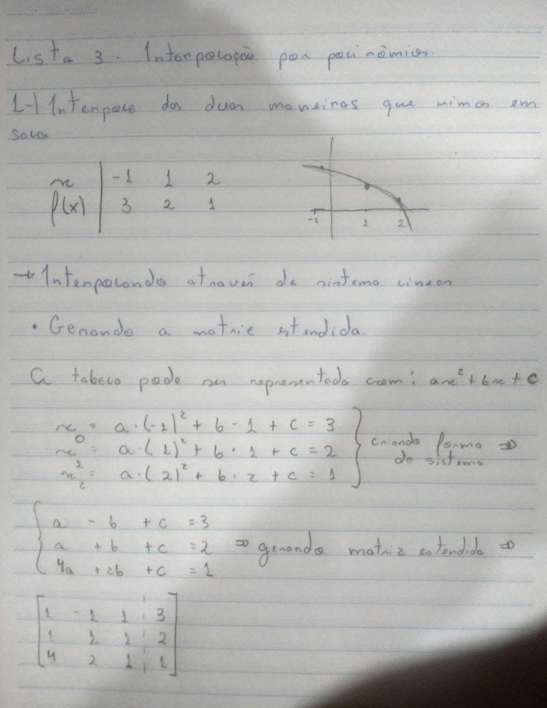
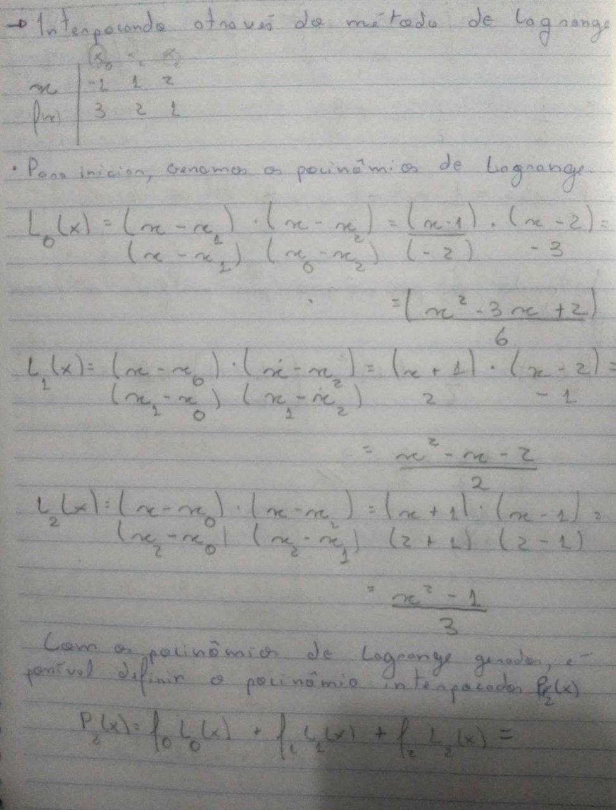

## Lista 3 - Interpolação por polinômios

Terceira lista de exercícios da matéria de matemática computacional (CAP-239-4), do curso de pós-graduação em Computação Aplicada do Instituto Nacional de Pesquisas Espaciais

Docentes:
- Dr. Leonardo B. L. Santos
- Dr. Reinaldo Rosa

Discente:
- Felipe Menino Carlos

### Exercícios

**1) Defina três pares de valores na tabela abaixo e interpola a mesma através das duas maneiras apresentadas em sala de aula (Sistema linear e Método de Lagrange)**

| $x$    | $x_0$    | $x_1$     | $x_2$     |
|--------|----------|-----------|-----------|
| $f(x)$ | $f(x_0)$ | $f(x_1 )$ | $f(x_2 )$ |

    

    

    

    

**Avaliação do resultado**: Como forma de avaliar o resultado, foi feita a utilização do Método de Eliminação Gaussiana (Implementado na [lista 2](https://fmenino-cap-239.netlify.com/lista_2/)) e também do método de interpolação de Lagrange ([Implementado](https://github.com/M3nin0/matematica-computacional/blob/master/listas/lista_3/code.md) em C++)

**2) Para uma tabela com 4 pontos, vá, progressivamente (de 1 a 3), aumentando o grau do polinômio interpolador - compare graficamente as soluções e discuta uma "amostragem preferencial"**

Para a realização deste exercício, foi escolhido um conjunto de pontos que tem seu formato parecido com uma pequena curva. A escolha foi feita por conta do interesse em ver como a interpolação funciona para funções com este formato.

| $x$    | 1 | 3 | 5 | 7 |
|------|---|---|---|---|
| $f(x)$ | 2 | 4 | 3 | 4 |

A visualização dos dados é apresentada abaixo.

    

Com esses elementos definidos a interpolação de Lagrange foi aplicada, como apresentado nos passos abaixo.

    

    

    

Com a conclusão da aplicação do método, os seguintes polinômios de Lagrange foram gerados

$$
l_0(x) = -\frac{x^3}{48}+\frac{5x^2}{16}-\frac{71x}{48}+\frac{35}{16}
$$

$$
l_1(x) = \frac{x^3}{16}-\frac{13x^2}{16}+\frac{47x}{16}-\frac{35}{16}
$$

$$
l_2(x) = -\frac{x^3}{16}+\frac{11x^2}{16}-\frac{31x}{16}+\frac{21}{16}
$$

$$
l_3(x) = \frac{x^3}{48}-\frac{3x^2}{16}+\frac{23x}{48}-\frac{5}{16}
$$

Para a geração do polinômio interpolador, foi feito

$$
f_0 * l_0(x) + f_1 * l_1(x) + f_2 * l_2(x) + f_3 * l_3(x)
$$

Gerando assim, o seguinte polinômio interpolador

$$
P_3(x) = \frac{5x^3}{48}-\frac{21x^2}{16}+\frac{235x}{48}-\frac{27}{16}
$$

**Teste com os graus de polinômios**: O objetivo deste teste foi verificar o comportamento dos polinômios gerados, desta forma, o polinômio $P_3$ foi decomposto em 3 polinômios, sendo esses gerados de $P_1$ até $P_3$.

$$
P_1(x) = \frac{235x}{48}-\frac{27}{16}
$$

$$
P_2(x) = -\frac{21x^2}{16}+\frac{235x}{48}-\frac{27}{16}
$$

$$
P_3(x) = \frac{5x^3}{48}-\frac{21x^2}{16}+\frac{235x}{48}-\frac{27}{16}
$$

Após a decomposição, cada um dos polinômios gerados pode ser visualizado separadamente, fazendo com que o comportamento e influência de cada um desses no $P_3$ fosse melhor compreendida.

    

Perceba que, para o caso do comportamento da função que estava sendo analizada, o aumento do grau do polinômio foi extretamente necessário para que houvesse a convergência entre o formato original e o interpolado, mas interessante apontar também que, para o caso de outras funções sendo interpoladas, a depender de seu comportamento, um polinômio de maior grau nem seja necessário, sendo um de menor grau suficiente para a interpolação em boa parte dos pontos

**Teste com a variação da quantidade de pontos**: Após realizar a decomposição do polinômio interpolador, surgiu a curiosidade em entender como cada um dos pontos influência no processo de interpolação dos dados. Então, o processo de interpolação de Lagrange foi aplicado várias sobre o conjunto potência ($2^A$) da tabela de pontos, considerando que, para cada caso, um conjunto de pontos foi utilizando.

Ou seja, para a geração do primeiro polinômio interpolador $P_0$, apenas um ponto foi utilizado, para o $P_1$ dois pontos foram utilizados, seguindo essa lógica até todos os pontos terem sido utilizados. O resultado é apresentado abaixo

    

Através desse resultado é possível perceber como o ajuste vai sendo feito para o formato dos pontos que estão sendo considerados na interpolação.

**Teste com vários valores gerados pela função interpoladora**: Com a finalização do teste anterior, como forma de testar o polinômio interpolador resultante de todo o processo, interpolações com pontos dentro do intervalo interpolado foram feitas.

Os resultados foram condizentes, todos seguindo a lógica da curva que é modelada pelos pontos da tabela. Porém, em todos os testes o comportamento interpolado tinha um comportamento "quadrado", sendo representado por uma curva sem nenhum tipo de suavização, parecendo apenas com a ligação de vários pontos por uma reta (Que era exatamente o que estava ocorrendo).

Então, assumindo esse comportamento da função interpoladora, de ligar vários pontos, seguindo o comportamento interpolado, foi gerado alguns testes variando a quantidade de pontos interpolados através do polinômio de interpolação.

    

Com este resultado fica claro entender a maneira como o polinômio de interpolação busca convergir seu resultado para o comportamento utilizado como base para a interpolação.

<!-- **Pergunta**: Um polinômio de 3° grau normalmente gera algo parecido com uma curva, e se eu tiver um conjunto com mais de três pontos e interpolar, o que ocorre na função de interpolação. -->

<!-- Neste exercício, ao falar sobre a integração, falar sobre a experiência feita com mais pontos na interpolação e dizer que buscou e encontrou sugestões de o pq o problema ocorrer (https://www.quora.com/What-are-the-advantages-and-disadvantages-to-use-higher-order-polynomials-in-Lagranges-interpolation) -->
