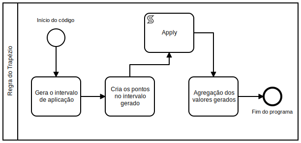

## Implementação de métodos de integração numérica

Este documento apresenta a implementação dos métodos de integração numérica por retângulos e por trapézio para a lista de exercícios 4 na disciplina de matemática computacional (CAP-239-4) do Instituto Nacional de Pesquisas Espaciais, foi feito utilizando a linguagem de programação C++, os códigos implementados e conceitos são apresentados nas seções abaixo.

### Regra dos retângulos

Para a implementação da regra dos retângulos, duas funções foram criadas, `RectangleRuleFunction`, que aplica a integração numérica em uma função definida e `RectangleRuleTable` que aplica a integração sobre uma tabela de dados com as variáveis dependentes do problema.

Abaixo um pouco da forma como cada uma das funções citadas foi implementado

**RectangleRuleFunction**: Para esta função, foi implementado o método de integração por retângulos compostos, onde o espaço é dividido em n subespaços e em cada um desses um retângulo é inserido e utilizado para a realização da integração.

**RectangleRuleTable**: Esta função, da mesma forma que a `RectangleRuleFunction`, trabalha com a regra dos retângulos composta, a diferença aqui é que ao invés do recebimento de uma função, os valores dependentes já são recebidos na chamada da função.

**Exemplo de utilização**: O código abaixo apresenta as formas de utilização de ambas as funções

```cpp
#include "rectangle.hpp"

double f(double x)
{
    return std::pow(x, 2);
}

int main()
{
    xt::xarray<double> yValues({0, 1.8, 2., 4., 4., 6., 4., 3.6, 3.4, 2.8, 0});

    // tabelas de dados
    NumericalIntegration::RectangleRuleTable(yValues, 0., 20., 10.);

    // funções
    NumericalIntegration::RectangleRuleFunction(f, 1., 10., 5.);
}
```

### Regra dos trapézios

Na implementação foram feitas duas funções principais a `TrapezoidalRule` e `TrapezoidalRuleRepeated` responsáveis pela aplicação da regra do trapézio simples e composta, respectivamente.

De maneira geral o funcionamento das duas funções é igual, possuindo os mesmos passos, sendo que, a diferença está justamente em como cada uma das funções realiza seus processos. A Figura abaixo apresenta os passos realizados por ambas as funções e em seguida uma breve explicação de cada um dos passos

<div align="center">
    
</div>

`TrapezoidalRule` Nesta função, a sequência de passos apresentadas pode ser sumarizada da seguinte forma:

- Gera o intervalo de aplicação: Neste passo é feito a subtração do valor final da integral pelo valor inicial;
- Cria os pontos no intervalo gerado: Para cada um dos pontos gerados no passo anterior é gerado o valor através da função que está sendo integrada. Isto é feito com o auxílio da função `Apply`, que básicamente gera os valores $y = f(x)$ para cada um dos pontos (Neste caso x) do intervalo gerado nos passos anteriores;
- Agregação dos valores gerados: Neste passo, todos os valores gerados anteriormente são agregados através da aplicação da regra do trapézio $\frac{h}{2} \cdot (f(a) + f(b))$

`TrapezoidalRuleRepeated` Nesta função, a sequência de passos apresentadas pode ser sumarizada da seguinte forma:

- Gera o intervalo de aplicação: Neste passo é feito a subtração do valor final da integral pelo valor inicial, este dividido pela quantidade de intervalos gerados;
- Cria os pontos no intervalo gerado: Para cada um dos pontos gerados no passo anterior é gerado o valor através da função que está sendo integrada. Isto é feito com o auxílio da função `Apply`, que básicamente gera os valores $y = f(x)$ para cada um dos pontos (Neste caso x) do intervalo gerado nos passos anteriores;
- Agregação dos valores gerados: Neste passo, todos os valores gerados anteriormente são agregados através da aplicação da regra generalizada do trapézio.

Existe também a função `TrapezoidalRulePoints`, uma especialização da função `TrapezoidalRuleRepeated`, que permite como entrada uma tabela de dados, não sendo necessário conhecer a função que gerou tais dados.

**Exemplo de utilização**: O código abaixo apresenta as formas das funções com regras do trapézio

```cpp
#include "trapezoidal.hpp"

double f(double x)
{
    return std::pow(x, 2);
}

int main()
{
    // Aplicação da regra do trapézio simples
    NumericalIntegration::TrapezoidalRule(f, 1., 1.30);

    // Aplicação da regra do trapézio composta
    NumericalIntegration::TrapezoidalRuleRepeated(f, 1.0, 1.30, 350.0);

    // Utilização (Sem função definida)
    xt::xarray<double> yValues({0, 1.8, 2., 4., 4., 6., 4., 3.6, 3.4, 2.8, 0});
    NumericalIntegration::TrapezoidalRulePoints(yValues, 0., 20., 10.);
}
```

### Considerações sobre o código

Considerando a simplicidade do método e a maneira com que o código foi implementada é possível afirmar que o código apresenta bom desempenho com poucos ou muitos intervalos a considerar, mesmo em funções mais complexas.
