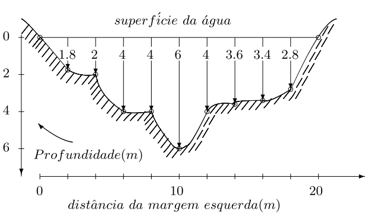

## Lista 4 - Integração numérica

Quarta lista de exercícios da matéria de matemática computacional (CAP-239-4), do curso de pós-graduação em Computação Aplicada do Instituto Nacional de Pesquisas Espaciais

Docentes:
- Dr. Leonardo B. L. Santos
- Dr. Reinaldo Rosa

Discente:
- Felipe Menino Carlos

### Exercícios

**1) Mostre a área da seção reta da figura apresentada no contexto abaixo**

A determinação da área da seção reta de rios é lagos é importante em projetos de prevenção de enchentes (para o cálculo de vazão da água) e nos projetos de reservatórios (para cálculo do volume total de água). A menos que dispositivos tipo sonar sejam usados na obtenção do perfil do fundo de rios/lagos, o engenheiro civil deve trabalhar com valores de profundidade, obtidos em pontos discretos da superfície. Um exemplo típico de seção reta de um rio está mostrado na figura a seguir:

    

$$
x_{j+1}=x_j+h_j
$$

$$
l\left(f\right)\cong f\:\left(\frac{a+b}{2}\right)\cdot \left(b-a\right)
$$

$$
\Delta x\:=\:h_j
$$

$$
R\left(h_j\right)=\sum _{j=1}^n\:f\left(\frac{x_j+x_{j+1}}{2}\right)\cdot h_j
$$

$$
\int _a^b\:f\left(x\right)dx\cong \frac{h}{2}\cdot \left(f\left(a\right)+f\left(b\right)\right)
$$

$$
\int _a^b\:f\left(x\right)dx\cong \frac{h}{2}\cdot \left(f\left(x_a\right)\:+\:2\cdot \left(f\left(x_1\right)+f\left(x_2\right)+.\:.\:.\:+f\left(x_{b\:-\:1}\right)\right)\:+\:f\left(x_b\right)\right)
$$

$$
\int _a^b\:f\left(x\right)dx\cong \frac{h}{2}\cdot \left(f\left(x_a\right)\:+\:2\cdot \left(\sum _{n=1}^{b-1}\:f\left(x_n\right)\right)\:+\:f\left(x_b\right)\right)
$$

**2) Seguindo os passos descritos abaixo, apresente os resultados**

- Escolha um polinômio A, de ordem 3;
- Interpole A por um de ordem 2, B, dados 3 pontos
- Calcule a integral de A e a integral de B analiticamente
- Calcule a Integral de B pela Regra do ponto médio
- Calcule a Integral de B pela Regra dos trapézios, para n crescente
- Analise as diferenças encontradas – e tente
generalizar seu resultado
