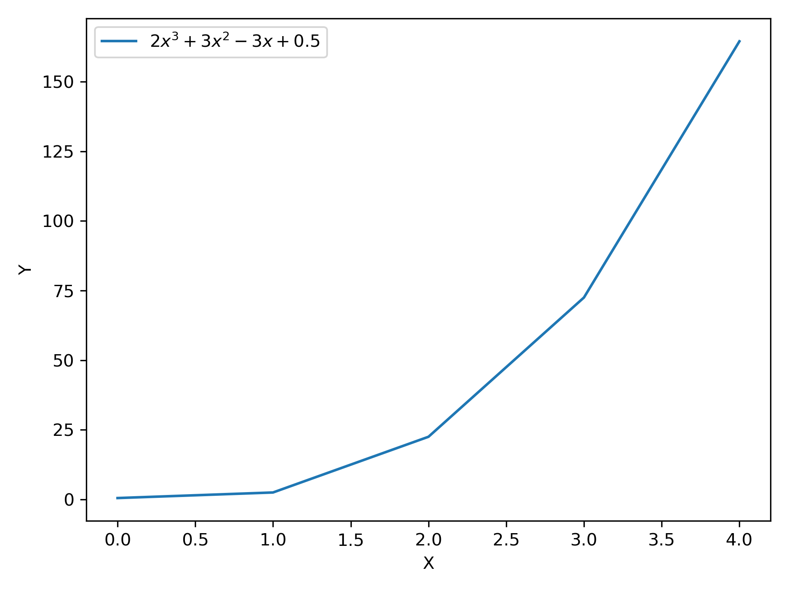
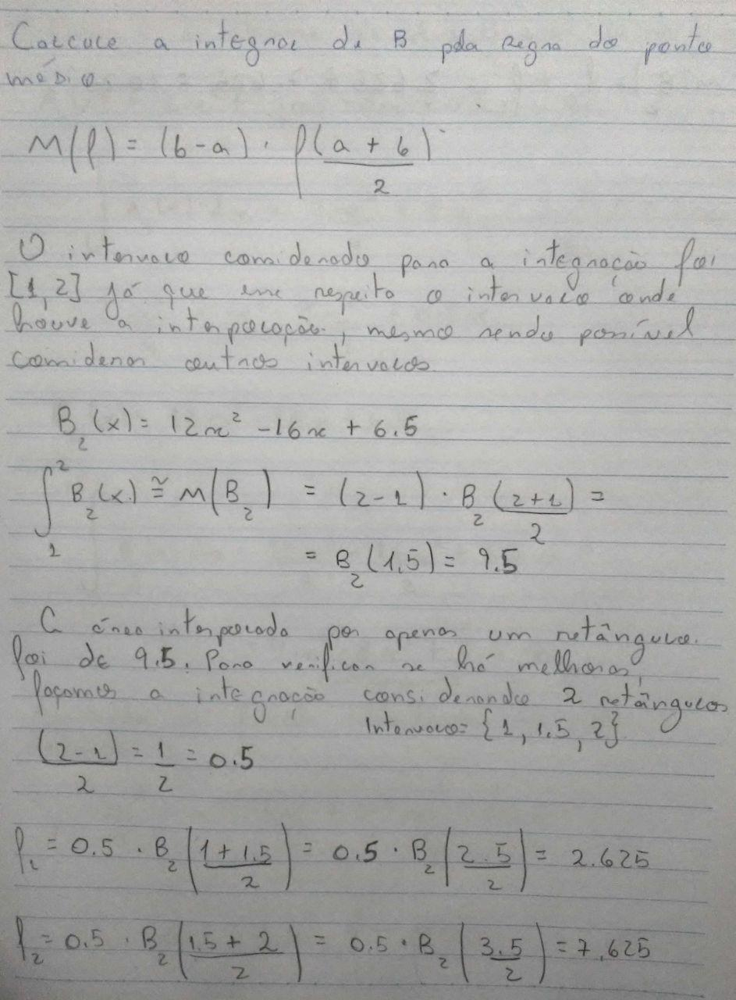

## Lista 4 - Integração numérica

Quarta lista de exercícios da matéria de matemática computacional (CAP-239-4), do curso de pós-graduação em Computação Aplicada do Instituto Nacional de Pesquisas Espaciais

Docentes:
- Dr. Leonardo B. L. Santos
- Dr. Reinaldo Rosa

Discente:
- Felipe Menino Carlos

### Exercícios

**1) Mostre a área da seção reta da figura apresentada no contexto abaixo**

A determinação da área da seção reta de rios é lagos é importante em projetos de prevenção de enchentes (para o cálculo de vazão da água) e nos projetos de reservatórios (para cálculo do volume total de água). A menos que dispositivos tipo sonar sejam usados na obtenção do perfil do fundo de rios/lagos, o engenheiro civil deve trabalhar com valores de profundidade, obtidos em pontos discretos da superfície. Um exemplo típico de seção reta de um rio está mostrado na figura a seguir:

<div align="center">
    
</div>

Para o início deste exercício, o primeiro passo foi definir a tabela de valores que poderia ser utilizada no processo de integração, então, considerando a distância da margem esquerda (Metros) como $x$ e cada uma das profundidades como a variável dependente $y$, um tabela abaixo foi criada

|        | $x_0$ | $x_1$ | $x_ 2$ | $x_3$ | $x_4$ | $x_5$ | $x_6$ | $x_7$ | $x_8$ | $x_9$ | $x_{10}$ |
|:------:|:-----:|-------|--------|-------|-------|-------|-------|-------|-------|-------|--------|
|   $x$  |   0   | 2     | 4      | 6     | 8     | 10    | 12    | 14    | 16    | 18    | 20     |
| $f(x)$ |   0   | 1.8   | 2.0    | 4.0   | 4.0   | 6.0   | 4.0   | 3.6   | 3.4   | 2.8   | 0      |

Com esta tabela a integração já pode ser realizada. Aqui, todos os métodos apresentados em sala de aula poderia ser utilizados para a realização do processo, porém como uma forma de buscar o processo mais prático para a integração, a regra dos trapézios composta foi utilizada.

O fato da regra ser composta está intimamente relacionado com as características da tabela de dados, onde há diversos subintervalos que precisam ser considerados. As Figuras abaixo apresentam a solução deste método "na mão".

<div align="center">
    
</div>

Um ponto relevante a este exercício é que, a quantidade de subdivisões inseridas precisa, necessariamente, ser a mesma da quantidade de itens presentes na tabela, isso ocorre já que, caso haja mais intervalos que pontos na tabela, não é possível gerar tais valores sem a utilização de outras técnicas.

**Validação**: Todos os resultados gerados e apresentados acima, foram validados com a [implementação do método](https://github.com/M3nin0/matematica-computacional/blob/master/listas/lista_4/code.pdf) feita em C++

**Sobre a escolha do método**: Para este caso, a escolha da utilização da regra dos trapézios, como já informado, foi feito por uma questão de praticidade de aplicação.

Além do motivo da praticidade, podem ser a aproximação feita por um método é melhor que outra, isso considerando os métodos de integração por retângulos e por trapézios. Para avaliar as diferenças neste caso, foi feito a [implementação da regra do retângulo](https://github.com/M3nin0/matematica-computacional/blob/master/listas/lista_4/code.pdf), simples e composta, e então os dois métodos foram aplicados para verificar o resultado, que foram iguais nos dois casos.

Método dos retângulos
```cpp
xt::xarray<double> yValues({0, 1.8, 2., 4., 4., 6., 4., 3.6, 3.4, 2.8, 0});

NumericalIntegration::RectangleRuleTable(yValues, 0., 20., 10.);

// Saída: 63.2
```

Método dos trapézios
```cpp
NumericalIntegration::TrapezoidalRulePoints(yValues, 0., 20., 10.);

// Saída: 63.2
```

> Para este caso o resultado nos dois métodos foi o mesmo, porém isto não é uma regra, pode acontecer de um método apresentar mais precisão que outro.

**Interpolação para aumentor de subdivisões do espaço**: Ao trabalhar com as tabelas, acabei ficando com uma pequena curiosidade, até citei sobre isto no tópico de solução do exercício, o aumento da quantidade de subespaços em um contexto em que os dados são tabelas. A solução que encontrei para aumentar os subespaços foi interpolar os dados presentes na tabela, isso faz com que exista um polinômio que explica o comportamento da função em todos intervalos de valores da tabela, o que permite fazer espaços menores de trapézios.

Para fazer este teste, uma pequena implementação do método dos trapézios foi feita em Python. Em seguida a função de interpolação `spline` do pacote `scikit-learn` foi utilizada para a interpolação dos pontos na tabela, com a função interpolada disponível, a quantidade de intervalos pode ser aumentada.

```python
def trapezoidal_rule(fnc, integral_start, integral_end, parts):
    h = (integral_end - integral_start) / parts
    interval = np.arange(integral_start, integral_end + h, h)
    
    y_values = fnc(interval[interval <= integral_end])
    result = y_values[0] + (2 * np.sum(y_values[1:-1])) + y_values[-1]
    
    return result * (h / 2)
```

Abaixo a função de interpolação, permitindo um subintervalo maior

```python
import scipy.interpolate

x = list(range(0, 22, 2))
fx = [0, 1.8, 2., 4., 4., 6., 4., 3.6, 3.4, 2.8, 0]
fx_interp = scipy.interpolate.interp1d(x, fx)

trapezoidal_rule(fx_interp, 0, 20, 19)
```

Desta forma, os pontos podem ser integrados considerando mais partes, mesmo que as mesmas não estejam definidas na tabela de dados. Pode ser que, mesmo aumentando a quantidade de pontos, problemas com precisão sejam enfrentados, já que, com a aplicação de tal ideia, erros associados a interpolação podem intererir no resultado da integração.

> O método de interpolação spline não foi abordado durante as aulas, porém, como uma forma de realizar testes e a validação da ideia de interpolação para a possibilidade de aumentar os subespaços ele foi utilizado.

**2) Seguindo os passos descritos abaixo, apresente os resultados**

- Escolha um polinômio A, de ordem 3;
- Interpole A por um de ordem 2, B, dados 3 pontos
- Calcule a integral de A e a integral de B analiticamente
- Calcule a Integral de B pela Regra do ponto médio
- Calcule a Integral de B pela Regra dos trapézios, para n crescente
- Analise as diferenças encontradas – e tente
generalizar seu resultado

Vamos a cada um dos passos do exercício

- 1°) Definição do polinômio A

O polinômio A foi definido como

$$
A = 2x^3 + 3x^2 - 3x + 0.5
$$

Tal polinômio pode ser representado graficamente como

<div align="center">
    
</div>

- 2°) Interpole A por um de ordem 2, B, dados 3 pontos

Para este caso, a interpolação foi feita através com método de Lagrange com a seleção de 3 pontos gerados com o polinômio A.

<div align="center">
    
</div>

<div align="center">
    
</div>

- 3°) Calcule a integral de A e a integral de B analiticamente

<div align="center">
    
</div>

- 4°) Calcule a Integral de B pela Regra do ponto médio

Para a aplicação da regra do ponto médio, foi necessário encontrar os limites de integração. A definição foi feita de acordo com os pontos selecionados para a geração do polinômio $B$, sendo o limite inferior o valor do menor valor de $x$ dos pontos selecionados, e o maior valor de $x$ utilizado para o limite superior.

Para tal decisão, as integrais calculadas no passo anterior foram visualizadas graficamente, da mesma forma que apresentado abaixo

<div align="center">
    
</div>

Perceba que outros valores poderia ser utilizados, porém, para este caso, foi assumido que o comportamento anterior ou após os pontos interpolados podem não representar a realidade/comportamento da função aproximada, por isso, só foram considerados os valores dentro deste intervalo.

A Figura abaixo apresenta os passos "na mão" para a aplicação da regra do ponto médio.

<div align="center">
    
</div>

<div align="center">
    
</div>

- 5°) Calcule a Integral de B pela Regra dos trapézios, para n crescente

Para a realização desta etapa, foi feita a utilização da implementação da regra dos trapézios compostas.

Para tal, primeiro o polinômio $B$ foi definindo dentro do código

```cpp
double f(double x)
{
    return (12 * std::pow(x, 2)) + (-16 * x) + 6.5;
}
```

Após a definição, o polinômio $B$ foi utilizado para gerar um conjunto de valores $[1, 17]$ para verificar o comportamento da integração neste intervalo. 

```cpp
std::vector<double> integrationsSplited;

for (double i: xt::arange(1, 17, 2))
{
    integrationsSplited.push_back(NumericalIntegration::TrapezoidalRuleRepeated(f, 1., 2., i));
}
```

Os valores resultantes da integração feita acima são apresentados graficamente na Figura abaixo. 

<div align="center">
    
</div>

Ao visualizar o resultado é possível perceber que a convergência do método está próxima a 10.5, já que, quanto maior a quantidade de trapézios utilizados, mais o resultado se aproxima de tal valor.

Como forma de testar, o mesmo processo feito acima foi realizado novamente, porém aqui, com uma quantidade de trapézios no intervalo $[0, 1000)$

```cpp
std::vector<double> integrations1000;

for (double i: xt::arange(1, 1000))
{
    integrations1000.push_back(NumericalIntegration::TrapezoidalRuleRepeated(f, 1., 2., i));
}
```

<div align="center">
    
</div>

A hipótese levantada anteriormente foi confirmada, a convergência da integração numérica do polinômio $B$ é 10.5. Na Figura é possível perceber que, depois de um certo ponto, os valores não se alteram mais, mesmo com a quantidade crescentes de trapézios.

- 6°) Analise as diferenças encontradas – e tente generalizar seu resultado

Com base nos resultados apresentados no passo anterior, foi possível perceber que a convergência do resultado da integração está em 10.5. Como forma de validar, o processo de aproximação da integração numérica, a integral analítica do polinômio $B$ foi feita.

$$
\int _1^2\:\left(12x^2-16x+6.5\right) = 10.5
$$

Isto é uma maneira de confirmar que o resultado aproximado pela integração numérica não difere dos resultados calculados analiticamente, o que nos permite afirmar que, neste caso, não houveram erros significativos durante a aproximação.

**Considerações finais**: Durante a busca para a solução desta lista de exercícios, as seguintes conclusões puderam ser tomadas

- O aumento da subdivisão de espaços (Tendendo para zero), faz com que a precisão seja maior, quando comparado com a integral analítica, chegando a um ponto em que, o aumento dos subespaços já não fazem diferença e o valor aproximado é o mesmo que a solução analítica entrega;

- A interpretação geométrica para a integração é muito importante para que os métodos numéricos façam sentido e possam ser adaptados a diferentes casos;
