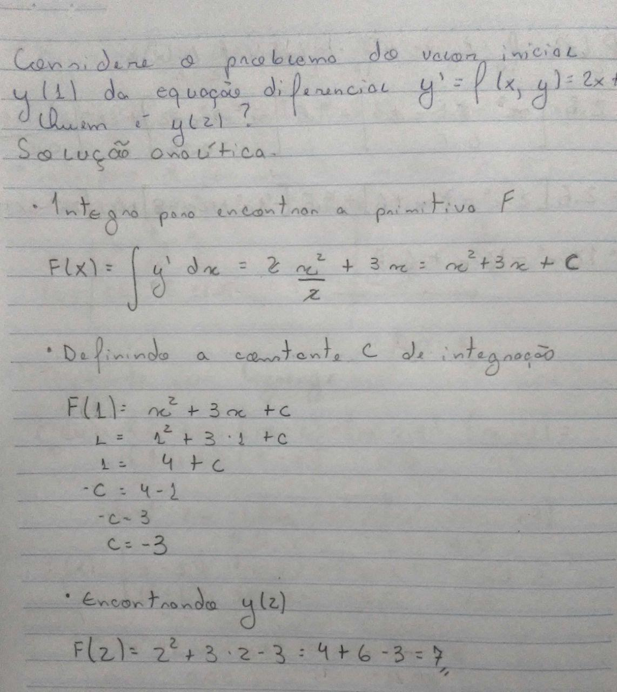
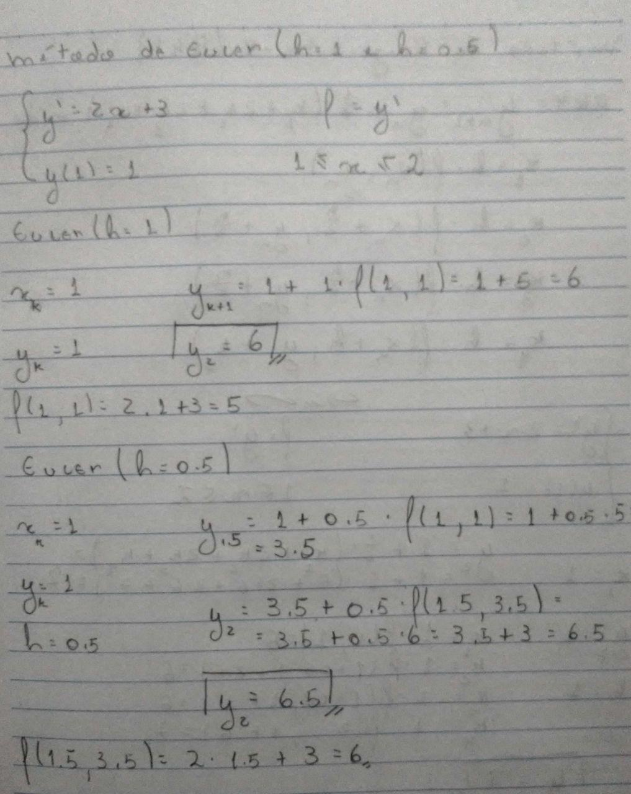
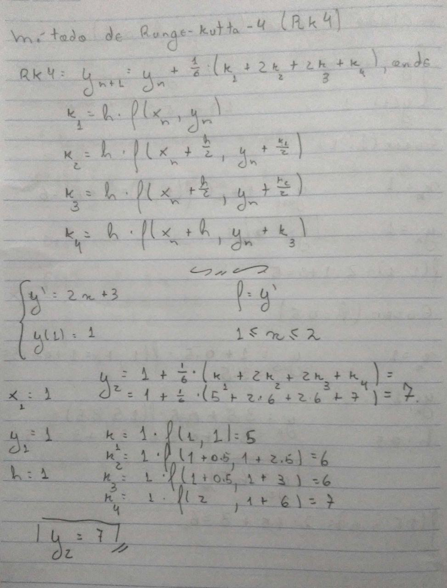
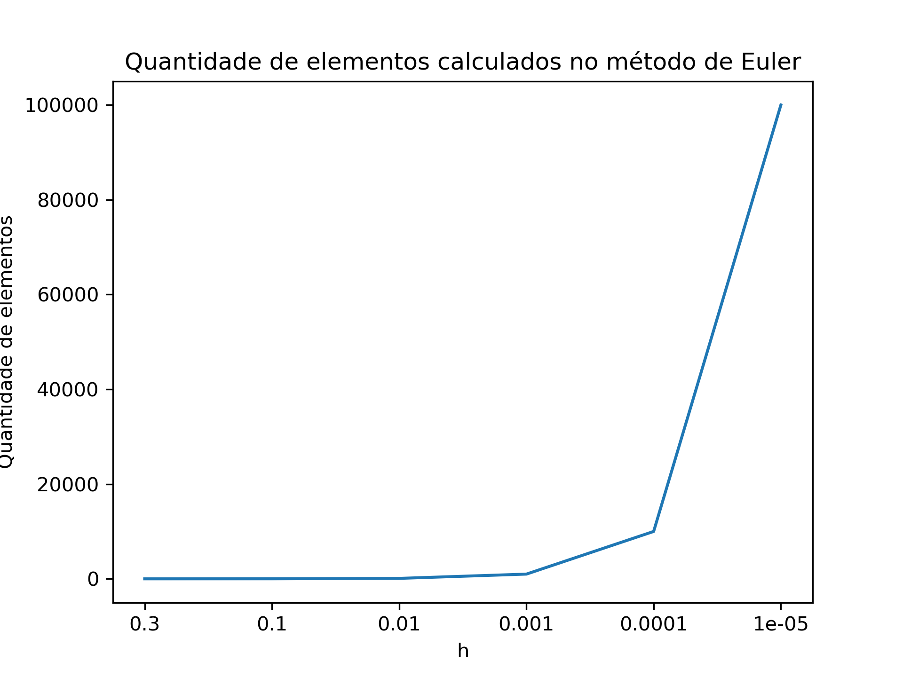
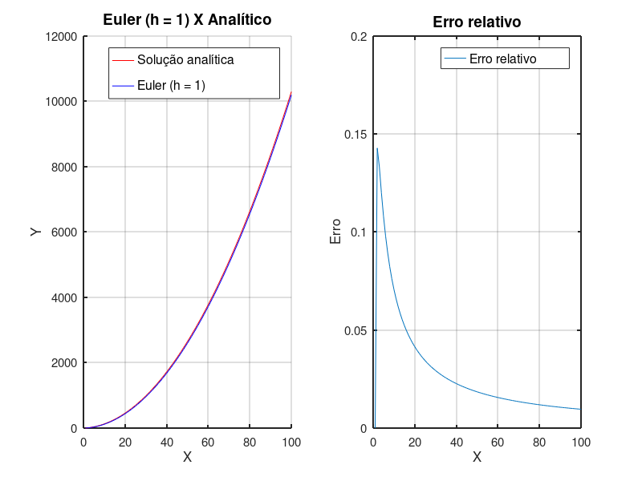
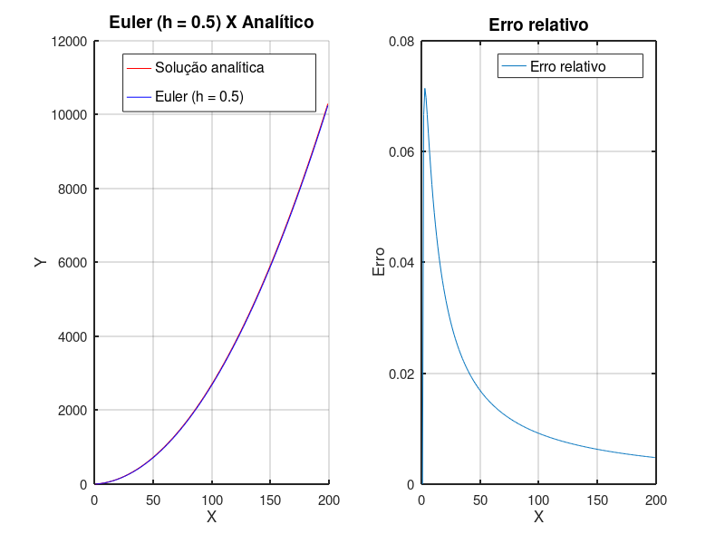
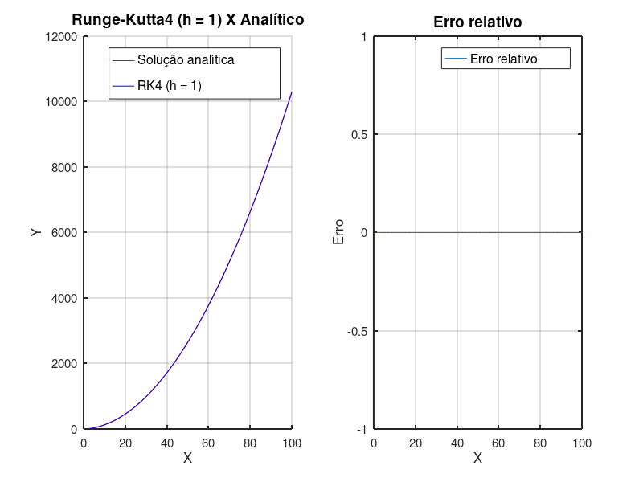

## Lista 5 - Soluções numéricas de Equações Diferenciais

Quinta lista de exercícios da matéria de matemática computacional (CAP-239-4), do curso de pós-graduação em Computação Aplicada do Instituto Nacional de Pesquisas Espaciais

Docentes:
- Dr. Leonardo B. L. Santos
- Dr. Reinaldo Rosa

Discente:
- Felipe Menino Carlos

### Exercícios

**1) Considere o problema do valor inicial $y(1) = 1$ da equação diferencial $y' = f(x, y) = 2x + 3$**

Quem é $y(2)$ ? 

Responda através dos seguintes métodos:

- Analítico
- Método de Euler (h = 1 e h = 0.5)
- Método de Runge-Kutta-4 (h = 1)

Cada um dos passos listados acima foi resolvido "na mão" e apresentados nas Figuras abaixo.

- Analítico

<div align="center">
    
</div>

- Método de Euler (h = 1 e h = 0.5)

<div align="center">
    
</div>

- Método de Runge-Kutta-4 (h = 1)

<div align="center">
    
</div>

**Validação dos resultados**: Para a validação de cada um dos resultados apresentados acima, foi realizado a [implementação dos métodos de Euler e Runge-Kutta](https://github.com/M3nin0/matematica-computacional/blob/master/listas/lista_5/code.pdf) com a linguagem de programação [Octave](https://www.gnu.org/software/octave/). Os resultados obtidos com as funções implementadas são apresentados abaixo:

Ao aplicar o método de Euler através da função implementada, é possível perceber que o valor correspondente a y(2) é exatamente o mesmo encontrado na solução apresentada anteriormente (Para h = .5)

```matlab
fnc = @(x, y) 2*x + 3;

[x, y] = eulerSolverEDO(1, 2, .5, 1, fnc);

% x = [1.0000 1.5000 2.0000]
% y = [1.0000 3.5000 6.5000]
```

Caso o valor de h seja aumentado para h = 1, teremos como resultado

```matlab
fnc = @(x, y) 2*x + 3;

[x, y] = eulerSolverEDO(1, 2, 1, 1, fnc);

% x = [1 2]
% y = [1 6]
```

Fazendo o mesmo processo com o método de Runge-Kutta (h = 1), temos o também o mesmo resultado encontrado anteriormente.

```matlab
[x, y] = rungeKuttaSolverEDO(1, 2, 1, 1, fnc);

% x = [1 2]
% y = [1 7]
```

**Testando o método de Euler com mais pontos**: Ao realizar o exercício proposto, uma coisa ficou clara, o método de Runge-Kutta-4 apresentou o mesmo resultado que a forma analítica, o que indica uma melhor aproximação da função criada.

Como uma forma de tentar fazer com que o método de Euler também chegue no mesmo valor, testes com a variação crescente da quantidade de pontos utilizados no método foi feito.

Para o exercício, os valores de h = 0.5 e 1 já haviam sido testados, então, alguns valores menores foram utilizados, a tabela abaixo apresenta os resultados

> Valores menores de h no mesmo intervalo indicam que haverão mais valores para preencher tal intervalo.

|    h   | Resultado |
|:------:|:---------:|
|   .3   |   6.0400  |
|   .1   |    6.9    |
| .01    | 6.9900    |
| .001   | 6.9990    |
| .0001  | 6.9999    |
| .00001 | 7         |

Veja que com uma quantidade muito pequena de h o valor 7, gerado com o método analítico e com o Runge-Kutta pode ser alcançado. Tudo bem, então a aproximação do método de Euler foi tão boa quanto as demais, porém, após a geração dos resultados, ficou evidente um problema, o custo que desta aproximação.

Enquanto o valor de h foi diminuindo, a quantidade de elementos calculados no método de Euler foi aumentando. O gráfico abaixo apresenta a maneira como a quantidade de elementos foi crescendo quando o h foi diminuíndo.

<div align="center">
    
</div>

Com isso, podemos voltar a uma discussão já levantada pelo professor Leonardo em uma das aulas, `O que é ter qualidade nos resultados ?`, claro, este é um caso pequeno, com uma função simples e um método que computacionalmente pode não ser tão custoso, mas, considerar certos pontos pode ajudar na escolha no método e na rápida obtenção dos resultados.

**Verificando erros**: Como forma de entender o comportamento de cada um dos métodos testados neste exercício, alguns testes de erros relativos foram realizados. A formula do erro relativa é apresentada por

$$
ErroRelativo\:=\:\frac{\left|y\:-\:\overline{y}\right|}{\left|y\right|}
$$

O primeiro teste foi feito com o ponto $y(2) = 2$ proposto pelo exercício, assim, foram feitas comparações de erro relativo entre o aproximado por cada função e a solução analítica, esta sendo utilizada como verdade.


|    Método    |    h   | Erro relativo | Erro relativo (%) |
|:------------:|:------:|---------------|-------------------|
|     Euler    |    1   | 0.14286       | 14.286            |
|     Euler    |   0.5  | 0.071429      | 7.1429            |
| Euler        | .00001 | 0.0000014286  | 0.00014286        |
| Runge-Kutta4 | 1      | 0             | 0                 |

A tabela com os erros relativos, apresentadas acima, vão completamente de encontro com o que já havia sido obtido anteriormente, onde os métodos de Euler tiveram uma aproximação melhor depois do aumento de $h$ (Aumento da quantidade de subespaços para o calculo da derivada) e para o método de Runge-Kutta de 4° ordem apenas um passo foi necessário. 

Ao finalizar este primeiro teste e entender o funcionamento da aproximação numérica das equações diferenciais, uma nova dúvida surgiu, se os pontos são sempre gerados considerando os anteriores, pode haver algum tipo de erro acumulado, de modo que o erro fosse aumentando com o aumento do intervalo considerado para a geração dos pontos. Para visualizar este comportamento novo teste foi feito, este agora considerando não somente o intervalo $[1, 2]$, mas sim $[1, 100]$.

Desta forma, o teste realizado foi, comparar cada um dos pontos, gerados pela função analítica e também os aproximados pelos métodos de Euler e Runge-Kutta de 4° ordem.

A Figura abaixo apresenta a relação de erros entre o método de Euler, com $h = 1$ e o método analítico. É possível perceber que, mesmo havendo um erro associado no início, os valores do mesmo foram sendo acentuados ao longo dos valores estimados.

<div align="center">
    
</div>

Como uma forma de testar a melhora com $h = 0.5$ o mesmo processo foi feito, e então foi possível perceber que, da mesma fora que na figura anterior, houveram erros no início, mas esses menores do que os apresentados antes. 

<div align="center">
    
</div>

Por fim, os métodos de Runge-Kutta de 4° Ordem, que com apenas um passo já conseguiram obter um erro igual a zero, e este comportamento se repetiu para todos os valores estimados, como é possível analisar na figura abaixo.

<div align="center">
    
</div>

Mesmo com os ótimos comportamentos obtidos acima, é preciso dizer que, eles foram obtidos sem grandes problemas por conta do cenário favorável a que os testes foram realizados, relacionando este principalmente a função que estava sendo analisada e sua baixa complexidade. Como informado por Carlos Balsa em suas [notas de aula](http://www.ipb.pt/~balsa/teaching/MA08_09/PVI_EDOs.pdf), existem funções que ao serem aproximadas podem apresentar comportamentos 'não comportados', por conta do acúmulo de erro ao longo da aproximação dos pontos, fazendo com que, quando mais pontos aproximados, maior o erro obtido.

> Para a construção desta solução, a página de [Tipos de Erros](https://www.ufrgs.br/reamat/CalculoNumerico/livro-py/rdneadm-tipos_de_erros.html) foi consultada, o material é simples e direto
