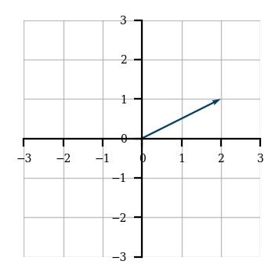
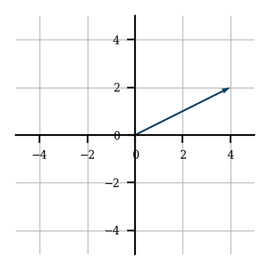
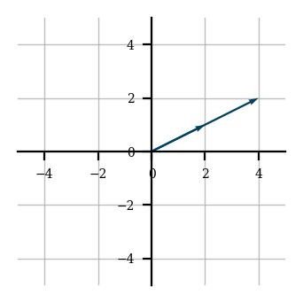
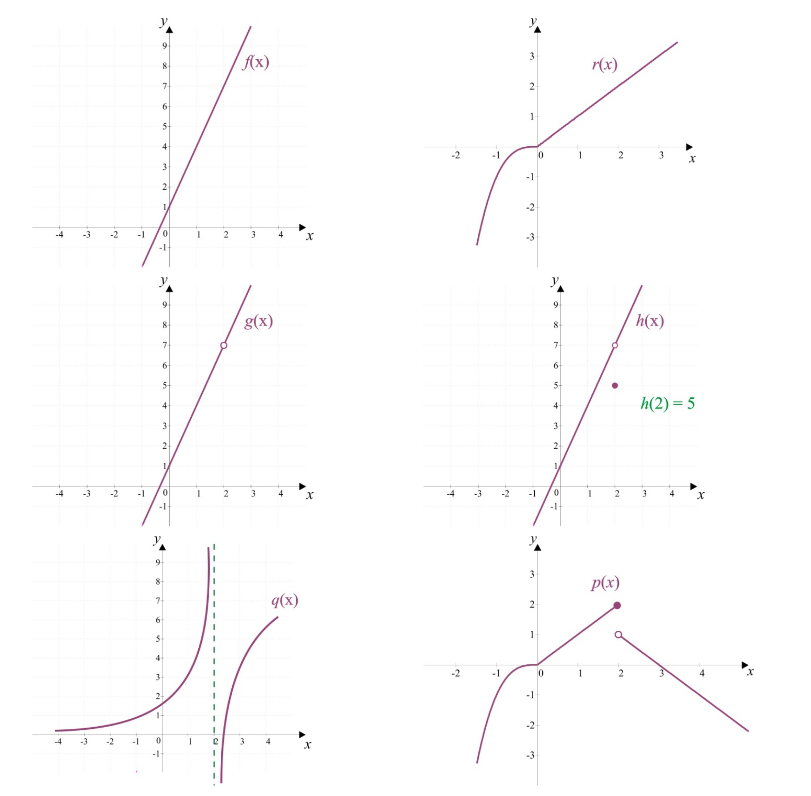

## Matemática computacional - Conceitos base

Este documento apresenta conceitos base para o entendimento da matéria de matemática computacional.

### Conteúdo com métodos discretos

Abaixo são listadas questões úteis para o entendimento da parte de conteúdos de métodos discretos.

* O que é um conjunto linearmente independente ?

Vetores são resultados da combinação linear de outros vetores, sendo esses projetados com as operações de soma e multiplicação.

Mas, existe um grupo de vetores um pouco diferentes, vetores que não podem ser obtidos com a operação conjunta de outros vetores, esses são os chamados de elementos linearmente independentes.

Para fixar o conceito, algumas outras definições são listadas abaixo:

> Um conjunto é dito linearmente independente se não for possível gerar um vetor deste conjunto através da combinação linear de demais conjuntos

> Vetores são linearmente independentes (LI) se nenhum dos vetores puder ser escrito como combinação linear dos demais

* O que é um espaço vetorial ?

Um espaço vetorial é um conjunto *V* equipado com as operações de soma de vetores e de multiplicação por escalares, essas que satisfazem um conjunto de propriedades.

Normalmente ao realizar a definição de um espaço vetorial, é feito um vínculo do mesmo a um determinado conjunto de valores (Por exemplo, conjunto dos números reais, complexos e etc). Tal vínculo não será feito nesta definição uma vez que, o espaço vetorial independe deste tipo de detalhe.

Entendendo o que é um espaço vetorial, voltamos para suas capacidades de soma e multiplicação, definidas anteriormente, essas devem ser feitas seguindo um conjunto de regras, como citado anteriormente, mas mais importante que isso, todas as operações realizadas, sejam elas de soma ou de multiplicação, devem levar a elementos válido do espaço vetorial *V*.

> Em resumo, é o conjunto de todos os vetores possíveis de serem gerados através da manipulação dos vetores base de tal espaço.

* O que é uma base para um espaço vetorial ?

Uma base para um dado espaço vetorial *V* é um conjunto *B* que:
- (a) gera *V* e;
- (b) é linearmente independente.

> Desta forma, as bases são os vetores citados na questão anteriores que, quando manipulados podem gerar todos os elementos do espaço vetorial

* O que é (entrada e saída) um produto escalar ? e um produto vetorial ?

| Método           | Entrada               | Saída         |
|------------------|-----------------------|---------------|
| Produto escalar  | par de vetores (A, B) | Valor escalar |
| Produto vetorial | par de vetores (A, B) | Vetor C       |

Nessa parte é interessante especificamente a interpretação geométrica de cada um dos métodos, essas são citadas abaixo:

* O que é a normal de um vetor ?

A normal ou **módulo** de um vetor é o comprimento desse vetor, que pode ser calculado do meio da distância de seu ponto final até a origem.

**Observação**: Achei interessante manter o módulo e até mesmo grifar ele uma vez que, o módulo geometricamente não representa o valor positivo, e sim a distância daquele elemento até sua origem. 

* Como calcular o determinante de uma matriz de ordem 2 ? E para ordens maiores que 3 ?

Para realizar o cálculo da determinantes de matrizes de ordem 2 é necessário realizar a multiplicação de sua diagonal principal e sua diagonal segundária e então subtrair o resultado da diagonal secundária do resultado da diagonal primária.

Para o cálculo da determinante de matrizes 3x3 é possível aplicar o método de Sarrus.

Já para determinantes de ordem N (Considerando N >= 3), é possível utilizar o método de laplace.

> Gosto da interpretação geométrica dos determinantes. Se você imagina que toda matriz é uma transformação linear, então as determinantes são utilizadas para indicar o quanto cada uma das áreas onde a transformação linear é aplicada será distorcida/modificada.

* O que é a transposta de uma matriz ? E a inversa ?

**Transposta de uma matriz**: A operação de transposição de uma matriz é aquele em que se obtém uma nova matriz através da troca de linhas por colunas
Desta forma, uma matriz transposta é aquele que passou pela operação de transposição e deve suas linhas trocadas por colunas (Ou colunas trocas por linhas)

**Matriz inversa**: Para a explicação de tal conceito, vamos voltar a um elemento bem básico, números reais. Imagine dois números reais **i** e **j**, **i** será o inverso de **j** se e somente se, **i** * **j** = 1
Da mesma forma como visto nos valores inteiros, a matriz inversa pode ser entendida como a matriz com valores inversos a sua matriz original (Alterando os valores e mantendo as propriedades de linhas e colunas). Desta forma é possível definir que uma matriz inversa representa uma matriz que é a inversa multiplicativa da matriz original. 

A forma de encontrar uma matriz inversa pode ser dada pela solução de um sistema linear.

**Lembre-se**: Para os números, sempre existira um inverso multiplicativo (Exceto para o zero), não importa o quão grande ou pequeno ele seja, ao multiplicá-lo pelo seu recíproco sempre teremos 1. Para o caso das matrizes, só existe uma matriz inversa, e ainda, existem matrizes que podem vir a não ter uma matriz inversa.

> Quando comecei a aprender sobre matrizes me perguntei: Por qual motivo eu quero uma matriz inversa ? A resposta é bastante simples, não existe a operação de divisão em uma matriz! Então obtendo sua inversa é possível eu realizar divisões de matrizes através de multiplicações :smile:

* Como fazer multiplicação de matrizes ?

Para responder esta questão é interessante que façamos a divisão deste conceito em alguns contextos, já que, a multiplicação matricial pode representar diferentes comportamentos em contextos diferentes.

**Multiplicação de uma matriz por uma escalar**

Para entender a multiplicação de um matriz por uma escala, primeiro imagine um vetor *V* sendo projetado em um espaço bidimensional, este vetor é formado pelas coordenadas (2, 1)

$$
V = \begin{pmatrix}2&1\end{pmatrix}
$$

Sua representação no plano cartesiano é vista abaixo

    

Certo, agora imagine que queremos escalar as coordenadas desse vetor, chegando em coordendas que são o dobro de onde o vetor está atualmente

$$
\begin{pmatrix}2&1\end{pmatrix}\rightarrow \begin{pmatrix}4&2\end{pmatrix}
$$

Para fazer isso basta realizarmos a multiplicação do vetor por 2, ao realizarmos essa operação estamos `escalando`, essa operação geometricamente pode ser representada com

    

Se colocarmos no plano o vetor anterior e o vetor escalado teremos

    

Desta forma podemos entender que, quando estamos fazendo a multiplicação de um vetor por uma escalar, estamos `escalando` os valores do vetor, ou seja, simplesmente pegando cada elemento do vetor e multiplicando pela escalar.

> O nome escalar vem exatamente da operação que ela causa no vetor.

**Multiplicação de matrizes com elementos n-dimensional**

Antes de verificar o processo de operações com matrizes com elementos multidimensionais, façamos a definição de uma regra bastante importante

Para entender essa regra, suponha uma multiplicação entre as matrizes *A* e *B*, para que essa operação seja válida, é preciso que a quantidade de colunas da matriz *A* seja a mesma quantidade de linhas da matriz *B*.

    </img>

Isso faz com que o produto gerado tenha as dimensões (Linhas de *A*, Colunas de *B*)

    </img>

Pronto! Agora podemos ir para os conceitos de multiplicação matricial.

**Multiplicação de matriz por vetor**

Dado a matriz *M* e o vetor *V*, a multiplicação desses é feita através da multiplicação de todos os elementos de cada linha em *M* por todos os elementos da coluna em *V*.

$$
\begin{pmatrix}a&b\\ c&d\end{pmatrix}\cdot \begin{pmatrix}x\\ y\end{pmatrix}=\begin{pmatrix}ax+by\\ cx+dy\end{pmatrix}
$$

**Multiplicação de matriz por matriz**

A ideia da multiplicação de uma matriz *M* por uma matriz *J* é bastante parecida com o apresentado na seção anterior.

De forma geral, é necessário, para cada linha de *M*, multiplicar seus elementos por cada uma das colunas em *J*.

Como esta é uma operação com mais passos, vamos a um pequeno exemplo

$$
A\:=\:\begin{pmatrix}1&3\\ 2&5\end{pmatrix};\:B=\begin{pmatrix}2&2\\ 0&1\end{pmatrix}
$$

Com as matrizes definidas o que fazemos é realizar a multiplicação de cada uma das linhas da matriz *A* por cada coluna em *B*.

Então, para começar, a primeira linha é multiplicada com a primeira coluna, seu resultado é inserido na matriz resultante.

    </img>

Após isto, a mesma linha em *A*, utilizada na operação anterior é multiplicada com a segunda coluna.

    </img>

Depois, o mesmo passo é repetido para as demais linhas.

    </img>

    </img>

E este é o processo de multiplicação entre matrizes.

### Conteúdo com métodos contínuos

* Quando uma função é contínua ? e diferenciável ?

**Função contínua**

Para começar, vamos a uma definição informar, que reflete bem a ideia de uma função contínua. A grosso modo, uma função é contínua se é possível desenhar seu gráfico sem tirar o lápis do papel, ou seja, esta função não tem interrupções. Vejamos alguns exemplos de funções contínuas e não contínuas.

    </img>

Sendo que para cada função é possível fazer as seguintes considerações:
- $f(x)$ é uma função contínua em todo seu domínio;
- $r(x)$ é uma função contínua em todo seu domínio;
- $g(x)$ não é contínua em $g(2)$;
- $h(x)$ não é contínua em $h(2)$;
- $q(x)$ não é contínua em $q(2)$;
- $p(x)$ não é contínua em $p(2)$.

Para as funções $g(x), h(x), q(x), p(x)$ também pode ser afirmado que, elas são contínuas em qualquer intervalo que não contenha $x = 2$.

Vale dizer também que, para as funções $h(x)$ e $p(x)$ o valor $x = 2$ está definido em seu domínio, e mesmo assim, não é uma função contínua.

Informações retiradas do [material de Cálculo diferencial e integral da Unesp](http://www.calculo.iq.unesp.br/PDF/Continuidade-complemento.pdf)

**Função diferenciavel**

Uma função é dita derivável (ou diferenciável) quando sua derivada existe em cada ponto do seu domínio. 

> Toda função derivável é contínua, mas nem toda função contínua é derivável

Para entender melhor tal afirmação, vamos a definição de um teorema

Se $f:(a, b) \to \R$ é derivável em $x_0 \epsilon (a, b)$, então $f$ é contínua em $x_0$

O ponto deste teorema é que, seu inverso não é verdadeiro (Uma função contínua em $x_0$ é derivável em $x_0$)

Alguns exemplos de funções que são contínuas e não deriváveis são apresentados na figura abaixo

    </img>

Para a função `Ponto de bico`, os limites laterais da definição das derivadas são distintos e nos pontos de tangência vertical as inclinações da reta secante pela direta e pela esquerda são $+\infin$ ou $-\infin$.

* Como derivar e integrar polinômios ?

**Derivadas**: 

As derivadas representam a taxa de variação de uma dada função *f(x)*. Para mostrar a forma como uma derivada é feita, um exemplo é apresentado abaixo

$$
f(x) = \frac{x^2}{2}
$$

A derivada desta função é feita da seguinte forma

$$
f'(x) = \frac{2x}{2} = x
$$

Ou seja, o elemento que estava presente na potência é 'abaixado' e a potência é diminuida em 1. Para polinômios em que existam mais elementos envolvidos a regra é a mesma, com a diferença de que, cada um dos elementos terá sua derivada calculada separadamente.

$$
g(x) = \frac{3x^3}{2} + 9x + \sqrt{2}
$$

A derivada de tal função é

$$
g'(x) = \frac{9x^2}{2} + 9 + 0
$$

> $\sqrt{2}$ é um elemento constante, e a derivada (Leia, a taxa de variação) de uma função constante é zero.

Há casos em que as funções estarão sendo utilizadas em conjuntos com outras funções, com algum tipo de relação binária, para esses casos a tabela abaixo pode ser bastante útil.

| Tipo de derivação                            | Solução                                                                                                                                                               |
|----------------------------------------------|-----------------------------------------------------------------------------------------------------------------------------------------------------------------------|
| Derivada da soma / subtração                 | $$\left(f\left(x\right)\pm g\left(x\right)\right)'\:=\:f'\left(x\right)\pm g'\left(x\right)$$                                                                         |
| Derivada do produto: Regra do produto        | $$\left(f\left(x\right)\cdot  g\left(x\right)\right)'\:=\:f'\left(x\right)\cdot  g\left(x\right)+f\left(x\right)\cdot g'\left(x\right)$$                              |
| Derivada da divisão: Regra do quociente      | $$\left(\frac{f\left(x\right)}{g\left(x\right)}\right)'\:=\:\frac{f'\left(x\right)\cdot  g\left(x\right)-f\left(x\right)\cdot  g'\left(x\right)}{g^2\left(x\right)}$$ |
| Derivada de função composta: Regra da Cadeia | $$f\left(g\left(x\right)\right)'=f'\left(g\left(x\right)\right)\cdot g'\left(x\right)$$                                                                               |

Durante o processo de derivação é normal buscar estruturas já conhecidas para facilitar todo o cálculo. Para boa parte das regras apresentadas abaixo, uma [tabela de derivadas](https://www.if.ufrgs.br/tex/fisica-4/tab-integrais.pdf), contendo formas padrão de derivadas podem ser utilizadas.

**Integrais**: 

*Integrais nos ajudam a encontrar a área formada pela curva, melhor que isso, a integral é um método de multiplicação mais sofisticado*

O processo para a realização do cálculo da integral (anti-derivada) pode ser feito através da utilização dos conceitos abaixo.

Primeiro começamos com as integrais primitivas

| Integrais mais comuns                                                      | Observação                                                                  |
|----------------------------------------------------------------------------|-----------------------------------------------------------------------------|
| $$\int \:kdx\:=\:kx\:+\:C$$                                                | A constante C de integração é inserida por essa ser uma integral indefinida |
| $$\int \:k^ndx\:=\:\frac{x^{n\:+\:1}}{n\:+\:1}+C\:\left(n\:\ne -1\right)$$ | Para casos em que n = 1, usa-se $\frac{n}{x}$                               |
| $$\int \:\frac{1}{x}dx\:=ln\left(x\right)\:+\:C$$                          |                                                                             |
| $$\int \:e^xdx\:=e^x+C$$                                                   |                                                                             |
| $$\int \:a^xdx=\frac{a^x}{ln\left(a\right)}+C$$                            |                                                                             |

> As primitivas geométricas foram omitidas da tabela acima

Para algumas classes de funções, a integração seguindo as primitivas apresentadas pode não ser o suficiente, então, técnicas podem ser usadas para tentar contar tal problema e resolver a integração.

Os dois métodos, integração por `substituição` e `por partes` são algumas dessas técnicas, cada uma delas apresentadas abaixo

**Integração por substituição**

Na integração por substituição busca-se fazer mudanças na função original, essas mudanças são descritas através dos passos abaixo

- 1° - Identifica qual parte da função pode ser selecionado para ser derivado\*
- 2° - Com o elemento identificado, faça sua derivada e substitua os elementos da equação pelas variaǘeis $u$ e $du$, sendo $u$ o elemento selecionado no passo anterior e $du$ a derivada de $u$;
- 3° - Integre a função com as novas variáveis.

\* Essa escolha é feita procurando uma forma de, através da derivada da parte selecionada, chegar a uma outra parte também presente na função.

Para fixar o conceito, vamos a um exemplo. Considere a seguinte equação

$$
\frac{(-6x -5)}{(-3x^2 -5x - 2)} dx
$$

Nesta equação, vamos aplicar o primeiro passo, o de identificação de um elemento que quando derivado chega a outro elemento presente na equação. Para este caso, o elemento escolhido será $-3x^2 -5x - 2$

Desta forma, o elemento escolhido e sua derivada são

$$
u = -3x^2 -5x - 2
\\
du = -6x - 5
$$

Veja que $du$ já é equivalente a outro a um elemento que já estava na equação, dessa forma é possível montar a integral considerando tais variáveis

$$
\int \: \frac{du}{u}
$$

Esta integral tem uma característica bastante conhecida, e pode ser integrada diretamente, gerando o seguinte resultado

$$
\int \: \frac{du}{u} = \log(u) = \log(-3x^2 -5x - 2)
$$

Este método é bastante usual e interessante, porém não é todas as vezes que ele funciona (Assim como quase tudo no processo de integração), para casos em que esta técnica não resolve, existe a integração por partes

**Integração por partes**

Esta técnica para integração é bastante interessante e poderosa, através de um método recursivo ela vai dividindo a função e realizando integrações o quanto for necessário, sua formulação é dada por

$$
\int \:u\:dv\:=\:u\:\cdot \:v\:-\:\int \:v\:du
$$

Nesta técnica o objetivo central é encontrar o elemento $u$ da função. Ao encontrar tal elemento é possível através de derivação e e integração definir também os elementos $v, dv, du$ utilizados na formulação apresentada anteriormente.

O critério de seleção do $u$ pode ser descrito com o acrônimo LIATE, sendo que cada letra possui um significado e sua ordem indica a ordem de importância para a definição de um elemento como $u$.

$$
L = Logaritmo
\\
I = Inverta\ trigonométrica
\\
A = Algébrico/\ Potência
\\
T = Trigonométrica
\\
E = Exponencial
$$

Vamos ao passo a passo deste método e depois para um exemplo

- 1° - Definir o valor $u$ (Utilizando LIATE);
- 2° - Ao definir $u$ você também faz a definição de $dv$, que básicamente é tudo aquilo que não foi selecionado como $u$;
- 3° - Derive $u$ para encontrar $du$;
- 4° - Integre $dv$ para encontrar $v$;
- 5° - Substituia os elementos encontrados na formulação da técnica e pronto, a função estará integrada

> Pode ser que, após a substituição dos elementos na formula e aplicação da integração, você tenha que fazer outras integrais por parte ou mesmo substituição dentro do método.

Para finalizar, vamos a um exemplo. Considere a seguinte integral

$$
\int \: x * e^{3x}dx
$$

Veja que nessa integral não é possível realizar a aplicação de uma integral primitiva, ou mesmo a integração por substituição, nesse caso, precisamos fazer a integração por partes.

Seguindo o padrão, vamos ir por cada um dos passos que definimos anteriormente. Primeiro, identificar $u$.

Se notarmos bem, o elemento que pode ser tratado como $u$ é o $x$, uma vez que ele está na categoria A do LIATE, que vem antes do exponencial (Que talvez seja o elemento mais evidente da função).

Como definimos $u$, o valor $dv$ também é definido

$$
u = x
\\
dv = e^{3x}
$$

Agora, vamos encontrar os elementos $du$ e $v$

$$
du = \frac{d}{dx}\left(u\right) = 1
\\
v = \int \: dv = \frac{1}{3}e^{3x}+C
$$

Com esses elementos definidos, façamos a substituição na formulação da técnica

$$
\int \:u\cdot dv\:=\:x\:\cdot \:\frac{1}{x}e^{3x}-\int \frac{1}{x}e^{3x}du\:
$$

Resolvendo tal equação, chegamos ao resultado desejado

$$
x\frac{e^{\:3x}}{3}-\frac{e^{3x}}{9}
$$

Pronto! 

* O que é uma série de Taylor ?

Existem funções que podem ser trabalhosas de serem utilizadas, então técnicas são criadas para que aproximações dessas funções sejam feitas e elas não precisam ser usadas.

Uma dessas técnicas são as Séries de Taylor, que através de derivadas, busca criar um polinômio que se aproxime de uma função qualquer.

Para a realização dessa série faz-se básicamente um polinômio constituído com todas as derivadas (Em todas as ordens) da função que está sendo aproximada.

Fazendo uma definição um pouco mais formal, temos que

Seja $f$ uma função com derivadas de todas as ordens em algum intervalo $a$ como um ponto interior. Sua formulação é feita como apresentado abaixo

$$
f\left(x\right)=\sum _{n=0}^{\infty }\:\frac{f^{\:\left(n\right)}\left(a\right)}{n!}\left(x\:-\:a\right)^n
$$

Sabendo que, $a$ é o ponto utilizado para todas as derivações, $n$ é o grau da derivada e $x$ o valor que está busca ser gerado através deste polinômio.

**Algumas definições legais sobre Séries de Taylor**

*Série de Taylor busca representar uma função com uma série de potências*

*Aproximação de função por meio de um polinômio*

*Série de Maclaurin* é um caso particular de uma série de Taylor, onde o ponto considerado na série ($a$) é zero ($a = 0$)
